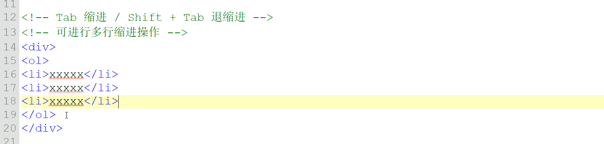
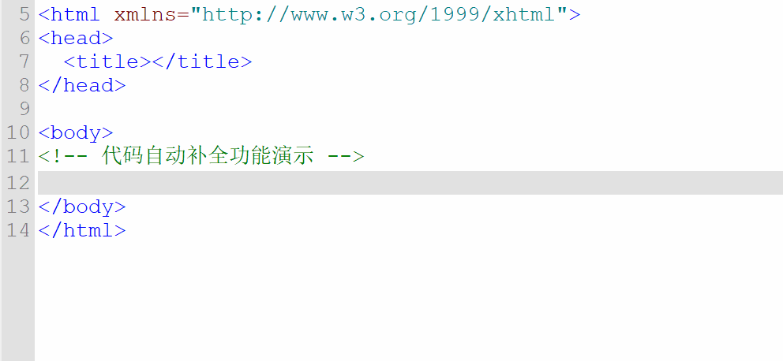
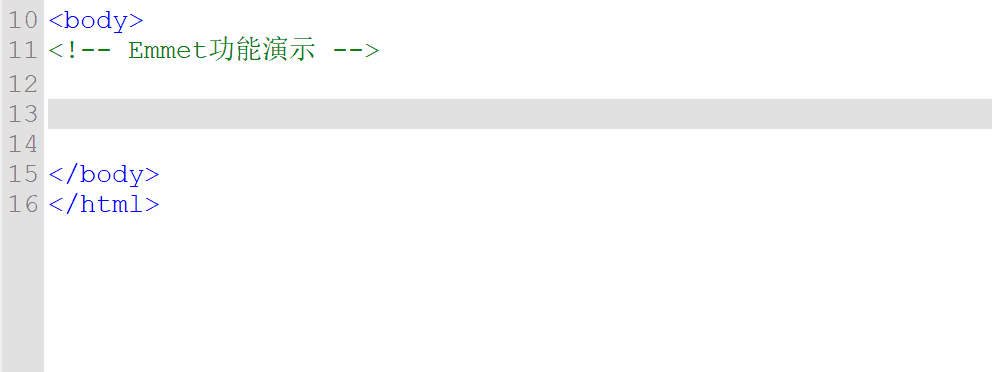
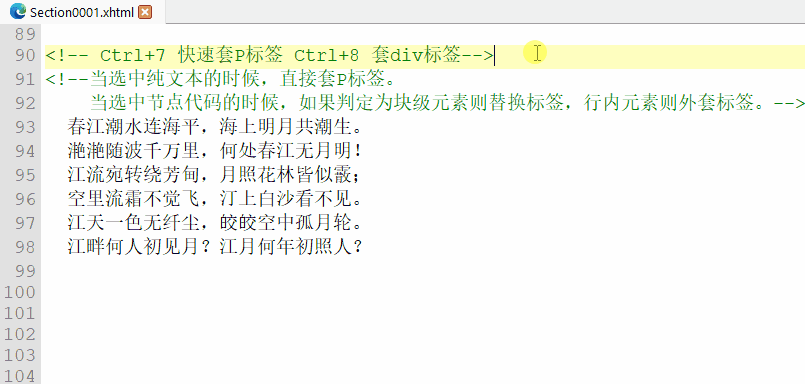
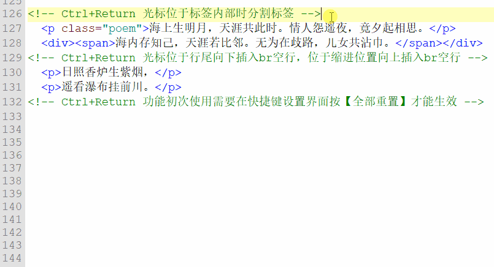
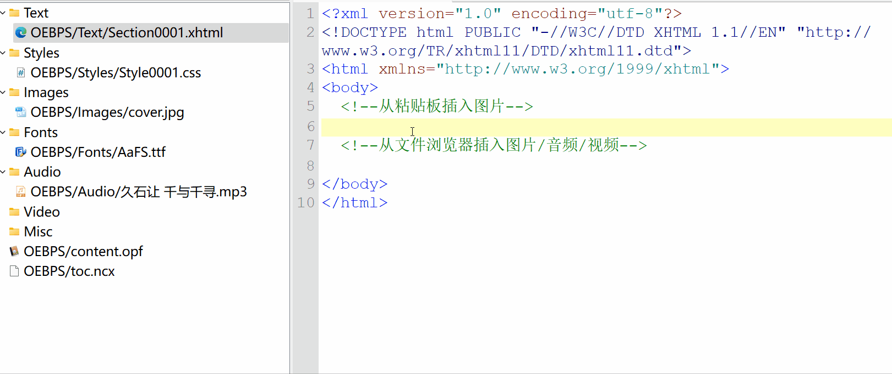
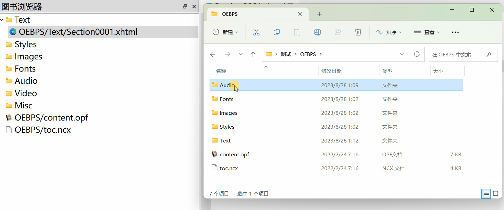
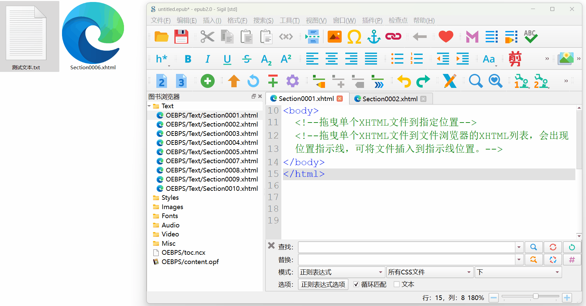

# Sigil-Enhanced

Sigil-Enhanced 是基于 Sigil 和 sigil-modified 继续维护的增强版 EPUB 编辑器。本项目以当前仍在维护的 Sigil 主线为基础，重新接入 sigil-modified 曾经提供的效率优化、编辑器增强、拖拽导入、插件管理改进等功能，并在后续维护中尽量跟随上游主线更新。

本项目基于以下项目和作者的工作继续维护：

* Sigil：感谢 Sigil 项目的原作者、维护者和所有贡献者提供长期维护的开源 EPUB 编辑器基础。
* sigil-modified：感谢原 sigil-modified 作者 ichigo250 对批量操作效率、代码编辑体验、插件管理和 EPUB 检查等功能所做的改进。

关于本项目的讨论、建议：https://t.me/+bUUc3T1rwVZmNWE9

## 增强功能

* 改进EPUB文件拖入：当从外部拖入EPUB到Sigil时，会提示选择是将文件添加到当前EPUB中，还是在新窗口编辑
* 优化撤销逻辑
* 内置Python3运行时以及必要的库
* 支持从文件浏览器直接将图片拖入编辑器并自动生成img标签或CSS url()链接
* 支持从剪贴板粘贴非本地文件
* 加入图片预览器：当光标停留在文件浏览器的图片文件上方时，会显示该图片的预览图，以及尺寸和体积
* 内置插件：规范化EPUB文件，包括文件结构、XHTML、CSS、OPF、NCX、文件格式正确性等等（感谢：Sigil吧@遥遥心航，本插件基于“重构epub为规范格式_v2.8.4”重构和优化；部分规则来自 https://github.com/w3c/epubcheck https://github.com/paginagmbh/EPUB-Checker）
* 内置插件：增强的代码格式化，用于将所有XHTML/CSS文件格式化为统一风格
* 内置插件：修正部分来源的EPUB文件，正文部分仅用br换行，段落没有p标签包围的情况
* 内置插件：修正部分KFX来源的EPUB文件，使用多个不包围段落的p标签的迷之结构

# =========
# 以下为 sigil-modified 的 README 内容：

# Sigil修改版
Sigil是目前主流的E非商业化EPUB制作工具，界面直观，功能丰富，配插件系统，可完成复杂的EPUB编辑工作。对于EPUB校验严格，规范明确，是目前同行软件中对于EPUB规范化做的最好的软件。但是Sigil的缺点也是比较明显，操作卡顿，是Sigil长期存在的一个问题，由于其对于批量文件操作的逻辑不合理，导致进行文件操作时，耗时跟随着文件数量增长而指数式上涨，在处理一些合集类的书籍，文件数量动辄上千，这种情况下进行文件批量操作往往要卡顿十几分钟到半小时，这点不少人有过切身体会。此外Sigil还有一些不够人性化的操作模式也是令人头疼。Sigil修改版的出现，正是为了优化Sigil的运行效率，提供一些更加人性化的操作模式，顺便解决一些遇到的BUG。

# 支持平台
仅支持`WIN10 (1809版以上)`，`WIN11`，`MacOS 11.X 以上版本`\
不支持 WIN7、WIN8，不支持MacOS 10.X 以下，至于Linux系统需要自己编译Sigil。

# 修改功能汇总

## 优化效率
1. 优化批量文件删除效率
2. 优化批量文件重命名效率
3. 优化批量添加文件的效率
4. 优化文件量大时设置Cover页耗时长的问题。

## 文件浏览器的改动

1. 修改可覆盖类型：添加字体文件改为可覆盖已存在同名文件
2. 拖曳添加文件：单个或多个文件可拖曳至文件浏览器，程序将自动归类并添加到epub中。
3. 多媒体文件（图片、视频、音频）和字体文件的右键菜单添加【插入文件代码】功能，可将文件的HTML节点或url链接插入到当前激活的HTML编辑器或CSS编辑器的光标处。
4. 拖曳单个XHTML文件，支持有序插入指定位置：\
从外部拖曳单个XHTML文件到XHTML文件列表上时，会出现位置指示线，支持将XHTML文件插入指示线位置。
5. 拖曳单个TXT文件，支持转化为 XHTML 并有序插入 XHTML 列表：\
从外部拖曳单个TXT文件时，如果拖曳到文件浏览器的XHTML列表区域，可将TXT文件转化为XTHML格式文件并插入到指示线位置。
如果不想要转化为XHTML格式，只需要把TXT文件拖曳到其他区域即可直接导入。

## 插件管理界面的改动

1. 支持覆盖安装插件：\
插件管理界面现可直接覆盖安装插件，不需要先删除后安装。检测到同名插件时会弹出提示选择是否覆盖安装（覆盖安装会先彻底删除原插件目录，而非直接覆盖）。

2. 自动绑定插件快捷位置：\
现安装插件之后，在插件快捷键工具栏有空位的情况下，该插件会自动到绑定插件快捷键位置。

3. 删除插件管理界面上【移除所有】的按钮\
该按钮的作用是删除所有插件，因为位置靠近删除单个插件的【移除插件】按钮，容易误触，因此现删除该按钮。
如果需要删除所有插件，可通过全选插件并点击【移除插件】按钮来实现。（【移除插件】按钮的逻辑也改为可删除复数插件）

4. 删除插件的操作逻辑改动：\
首先是插件管理界面的插件改为可多选（可通过 Ctrl、Shift 或 Ctrl+A 多选），同时原本为删除单个插件功能的【移除插件】按钮，功能改为删除选中的插件，因此该按钮现可删除单数或复数插件。

5. 插件快捷键图标即刻刷新：\
原版插件快捷键位置改动设置后，需要重启软件才会刷新相关图标，现在保存设置后可立即刷新，不需要重启。

## 代码编辑器的改动

1. 代码自动填充：\
添加简易的代码自动填充功能，支持HTML语法和CSS语法的自动填充，类似VSCode的 Spnippet功能（当然本功能要简陋的多）。
在配置管理界面设有功能的开关，可根据需求自行开启或关闭，一般建议开启。\
*小提示：* 自动填充功能的词汇表是Sigil默认用户配置目录下的两个json文件（`css_completion_words.json` 和`html_completion_words.json`），如需编辑建议在关闭Sigil的情况下进行编辑。非常规操作，有一定风险，编辑不当可能导致Sigil打开报错，出现这种情况直接删除配置文件即可，Sigil会自动生成新的默认配置文件。

2. Emmet代码缩写：\
添加"Emmet"代码缩写功能，类似VSCode的 Emmet功能，可通过Emmet代码缩写语法来完成HTML代码。语法同真正的Emmet完全一致，请自行上网查询语法。\
本功能仅实现Emmet关于HTML元素的缩写语法，不支持CSS缩写语法或 !Tab 生成代码。\
在配置管理界面设有Emmet功能的开关，可根据需求自行开启或关闭，一般建议开启。

3. 支持代码编辑器上直接粘贴图片：\
HTML编辑器或CSS编辑器在读取粘贴板内容时若检测到图片（包括图片数据和图片文件），会自动将图片添加至epub内，并根据编辑器类型生成粘贴内容为img节点或url链接。

4. 支持带格式文本粘贴（(Paste Rich Text)）：\
给HTML代码编辑器添加“粘贴带格式文本”功能，粘贴时可保留粘贴内容的HTML格式。\
富文本粘贴的快捷键默认是 Ctrl+Shift+V，可通过快捷键管理器修改，如果您已分配过该组快捷键，需要手动改回来或重置所有快捷键才能生效。

5. 支持多行套标签或修改标签：
    * 在Sigil原版，套标签(Ctrl+1 ~ Ctrl+7)只能整块选择文本套一层。现改为可多行套标签。
    * 如果文本已套有块级元素(Block Element)，则 Ctrl+1 ~ Ctrl+7 功能表现为改变标签名，同样支持多行修改标签名。

6. 添加套DIV标签功能（Ctrl+8）：
    * 逻辑同 Ctrl+1 ~ Ctrl+7，支持多行套div标签或修改标签名。

7. 代码编辑器支持Tab键多行缩进，Shift+Tab键退缩进：
    * **多行缩进**：Tab键缩进，按Shift + Tab键退缩进，支持多行缩进。
    * **Tab键改动**：Tab键改为输出2个空白字符，取代制表符，适合代码缩进。

8. 光标快速跳动至标签外边界（Alt+左右方向键）：
    * Alt + ← 键：光标往左跳动至标签代码的边界。
    * Alt + → 键：光标往右跳动至标签代码的边界。

9. 行首行尾键（Home、End键、MacOS是Ctrl+←、Ctrl+→）的逻辑改为——行首键（Home、Ctrl+←）先让光标跳跃至缩进位置，再跳至行首位置，行尾键则逻辑不变。

10. 闭合标签自动补齐：
    * 输入标签结束符">"时自动判断是否需要补齐，如需要则补齐闭合标签。
    * 输入闭合标签起始符号"</"时自动判断是否需要补齐，如需要则补齐闭合标签。

11. 换行自动缩进：\
采用类似于VSCODE等专业代码编辑器的换行自动缩进逻辑：
    * 当光标处于普通位置时：换行后自动对齐至上一行的缩进。
    *  当光标处于空白的“包裹结构”中间时（例如代码块{}或

的中间），换行后增加一级缩进，同时将“包裹结构”的尾部换行并对齐至头部。
    * 在输入代码块“{}”的尾部“}”时，如过头尾不在同一行，则自动对齐至头部。

12. 粘贴文本的缩进量控制功能：\
当光标处于缩进位时进行粘贴，会检测粘贴文本是否带有“缩进”(文本起始的一段连续空白符)，如果有，且两者缩进量相同，则自动省略一边的缩进。\
该调整的目的是为了避免一种情况：粘贴文本携带的缩进空白符，跟换行自动缩进的空白符叠加，造成非本意的过度缩进。

13. 添加【分割段落或插入br空行】功能——默认绑定快捷键Ctrl+Return\
Ctrl+Return 原为分割页面功能，现改为【分割段落或插入空行】的功能，功能描述如下：
    * **分割段落**：当光标处于标签内部时，把该处元素分割为两个并自动补齐标签。如果光标处于嵌套标签内部，则以距离最近的块级父元素为终点进行分割。
    * **插入空行**：当光标处缩进位置或者于行尾，则功能表现为插入 br 空行。
    需要注意的是，所谓绑定Ctrl+Return是指在缺乏配置文件情况下的默认绑定关系，因为原版已经分配过这组快捷键给【分割页面】功能并保存于配置文件，配置文件优先级高于默认绑定关系，因此安装修改版后 Ctrl+Return 这组块捷键的功能可能还是【分割页面】，可以到快捷键界面点击【全部重置（Reset All）】按钮恢复到默认绑定关系。或者手动分配快捷键也行，不想改也行，个人只是建议用 Ctrl+Return 这组快捷键取代旧功能【分割页面】，并将这组快捷键默认分配给本功能。

14. 添加【合并下一节点】功能——默认绑定快捷键 Ctrl+Alt+Return
    * 当光标处于节点文本位置时，可将当前节点后面的节点的外层标签去除后的内容追加到当前节点的文本尾部。
    * 当光标处于两个相邻兄弟节点中间时，且中间只有空白符，可以将后面的节点外层标签去除后的内容追加到前面节点的文本尾部。

## 综合功能的改动

1. 加强EPUB格式良好性检查功能（F7功能）：\
原版的EPUB格式良好性检查功能通常只能查出XHTML文档的标签有无闭合，许多错误在预览浏览器上会报错，但使用 F7 功能查不出来，因此该功能略显鸡肋。现经过修改后，可以查出多数预览会报错的XHTML文档错误。

2. 添加Sigil的OPF规范化功能（已整合到EPUB格式良好性检查功能中）：
    * 可检测到存在于epub但未登记于Manifest的文件，并自动补齐相关Manifest项。（除了xml, opf, 无后缀名、后缀名不受Sigil支持的文件。）
    * 可检查Manifest的重复ID项，并自动删除相关manifest项，删除重复ID时优先保留被spine或metadata引用的ID项。
    * 可检查Manifest的多余ID项，并自动删除相关manifest项，删除多余ID时优先保留被spine或metadata引用的ID项。
    * 可检查Manifest的无效href项，并自动删除相关项。
    * 可检查metadata或spine节点的无效引用ID，并提醒手动纠正。（无效引用ID，即所引用的ID没有登记到Manifest项中。）
    * 可检查package节点的xmlns属性和metadata的xmlns:dc、xmlns:opf属性是否正确，并提醒手动纠正。

3. 添加添加【Epub2转EPUB3】、【EPUB3转EPUB2】的功能\
   该功能可在菜单栏的【Epub3工具】中找到，在转化前它会调用【按Sigil格式重构Epub】功能对epub进行重构。\
   该功能主要翻译自Mobileread论坛的epub3和epub2转化插件，大致上效果跟插件一致，除了一个区别比较明显：Epub3转Epub2过程中，插件会强制把epub3节点转化为span节点，本功能不会。

4. 支持自定义的XHTML代码格式化：\
添加了XHTML代码自定义格式化的功能，配置接口在 “配置” >> "外观" >> "XHTML格式化" 项页中。\
采用类似CSS语法的配置，具体到对每个节点进行换行符和缩进级别的控制，可进行复杂度较高的自定义风格化。

5. 调整Sigil对TXT文本导入时的格式化逻辑：
    * 对导入TXT的文本格式化逻辑进行调整，修改为分行即分段的逻辑。\
    *PS：* 原逻辑是将换行的文本一律合并为同一段，遇到空行才会分下一段，即分行不等于分段，遇到空行才能分段。

6. 禁用Sigil原版的自动检查更新功能。

## 修复来自原版BUG
1. 修复简体中文界面下搜索替换的数量显示为%n的问题。
2. Sigil正则搜索的【循环匹配】和【重新开始匹配】功能冲突导致搜索非当前页时循环匹配无法生效，搜索当前页时按重新开始无法生效的BUG。
3. Win下快捷键设置无法设置Return键的BUG。
4. 修复epu3tools的使用“为epub2用户生成NCX/Guide文件”功能后，可能导致OPF的Mainfest项href错乱的BUG。
5. 修复一个关于搜索栏【循环查找】功能的BUG：自 Sigil 调整搜索栏UI，添加【Restart(重新开始)】功能后，部分情况下 【Wrap（循环查找）】 无法正常循环匹配，部分情况下 Restart 无法正常重置搜索起点的BUG。
6. 修复当选择非XHTML文件时，通过快捷键（默认为 Ctrl+Shift+Y 组合）触发【添加副本】功能时，会导致Sigil闪退的BUG。
7. 修复插件管理界面安装同名文件时，表面上看似只弹出提示而不执行任何操作，实际上会意外删除插件目录的BUG。
8.  修复套标签功能（ctrl+1 至 ctrl+7 快捷键功能）的BUG：当光标处于【长度超过输入区宽度的文本】上时，套标签无法套到整个段落的BUG。

# 部分功能演示
## 多行缩进、退缩进

## 代码自动补齐

## Emmet代码缩写

## 批量套标签

## 段落分割/插入BR空行

## 插入文件到HTML/CSS文档
* 从剪切板粘贴图片到EBOOK中并插入到HTML/CSS文档
* 从文件浏览器插入图片/音频/视频 HTML 中
* 从文件浏览器插入图片/字体到 CSS 中

## 拖入文件

## 拖入单个文件到指定位置

