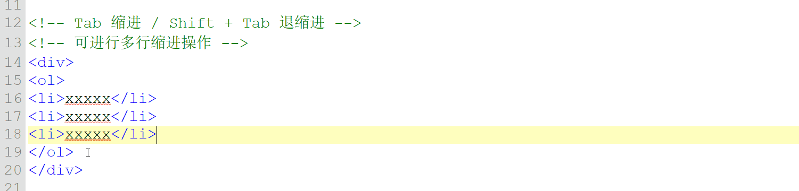
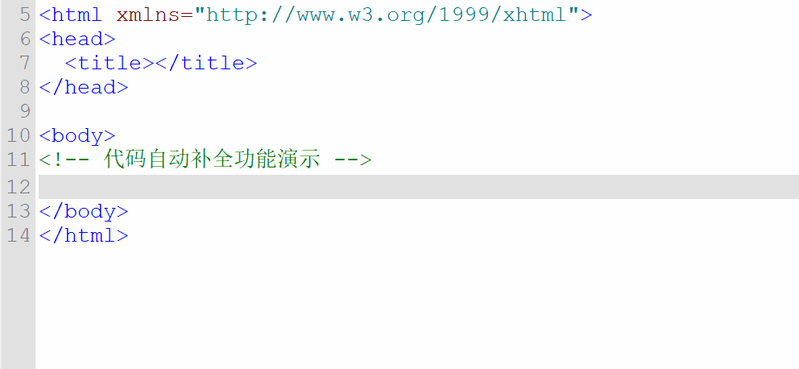
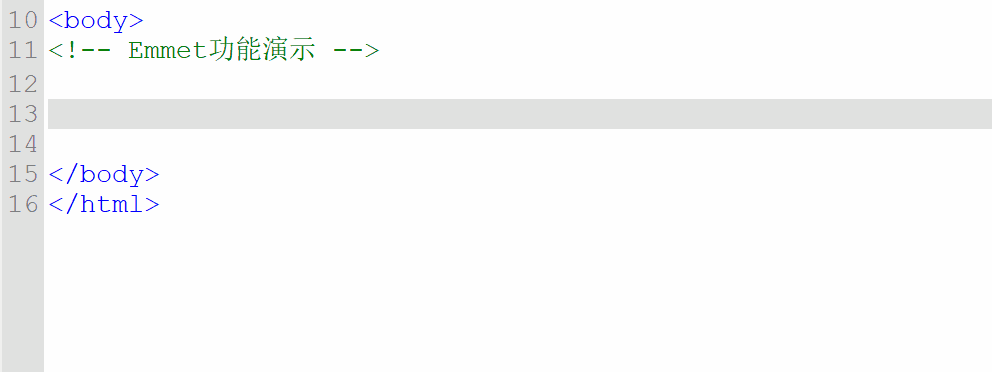
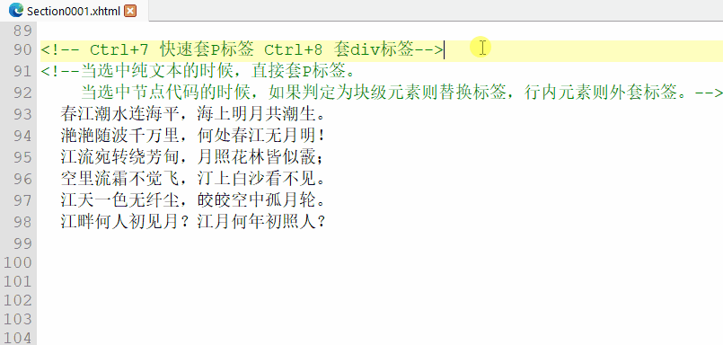
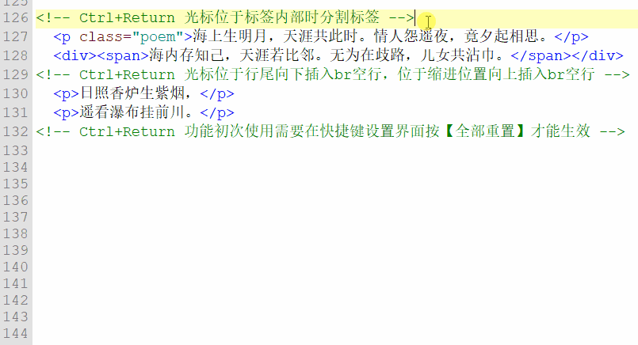
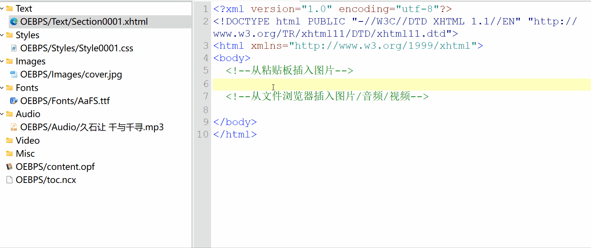
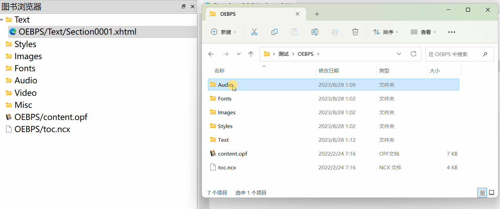
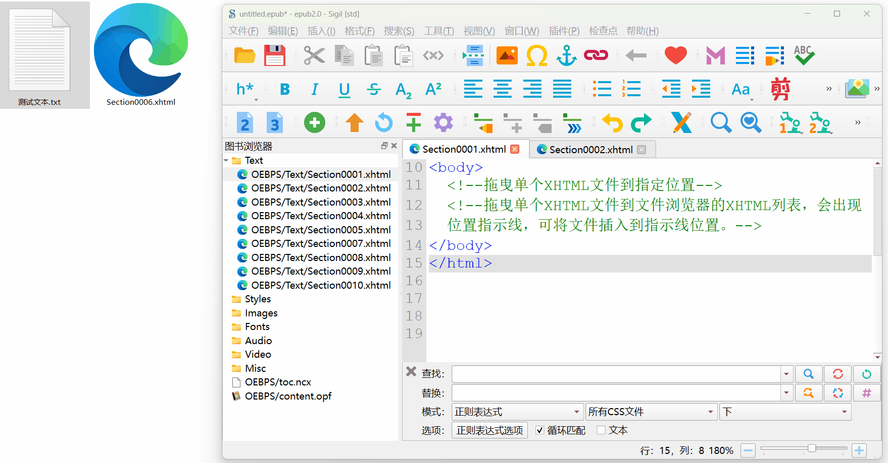

# Sigil-Enhanced

Sigil-Enhanced 基于 Sigil 最新版本以及早先的 sigil-modified@ichigo250 进行进一步开发，针对中文轻小说编辑进行了优化和增强。

## 致谢

- Sigil 的作者、维护者和各位贡献者。
- sigil-modified 的作者 ichigo250。
- [kfx2epub](https://github.com/2778995958/kfx2epub)，KFX 转 EPUB 用的是这个项目的转换代码。
- Sigil 吧的 @遥遥心航，EPUB 结构规范化是在他的规范化插件上改的。

## 交流

有问题或者建议，欢迎发issue或者使用以下IM进行反馈：

- Telegram：https://t.me/+bUUc3T1rwVZmNWE9
- QQ 群：796723288，入群答案是 3tic

## 版本

现在的最新版本是 2.8.5E11，这一版改了什么见[更新说明](docs/ReleaseNotes-2.8.5E11.md)。上一版 2.8.5E10 的说明在[这里](docs/ReleaseNotes-2.8.5E10.md)，更早的记录都在 [ChangeLog.txt](ChangeLog.txt) 里。

## 增强的功能

### 导入和拖放

- 从外面拖一本 EPUB 进来，可以并进当前这本书，也可以在新窗口里单独打开。
- 图片、字体、网页、TXT 这些文件拖进书籍浏览器就行，会自动放到该放的文件夹里。
- 单个 XHTML 文件可以拖到列表里的指定位置。单个 TXT 拖到 XHTML 列表里，会先转成 XHTML 再插进去；拖到别的地方就按原样导入。
- 图片拖进编辑器或者直接粘贴，会自动加进书里，引用也一并写好。
- 图片、音频、视频和字体的右键菜单里有「插入文件代码」，可以把引用插到当前编辑器的光标处。
- 鼠标停在书籍浏览器里的图片上，能看到缩略图、尺寸和文件大小。

### 界面和预览

- 预览区可以打开辅助网格，排版时方便对齐。网格只是看的，不会写进书里。
- 编辑区可以分成上下两块，同时看两个文件。
- 预览区下方可以打开开发者工具，也能拖出来变成单独的窗口。
- 用鼠标中键点一下标签页就能关掉它。
- 片段工具栏的按钮上会标出对应的快捷键。
- 打开字体文件时，会按书的语言显示中文、日文或英文的示例文字，并标出这个字体里缺了哪些字。
- 简体中文、繁体中文和日文都有翻译。最近新加的几处提示暂时只有简体中文。

### 代码编辑器

- 在代码里双击，默认选中一整段或者整个标签里的内容，不喜欢可以改回按词选。
- 写 HTML 和 CSS 时有简单的自动补全，可以在设置里关掉。
- 支持 Emmet 缩写，只管 HTML 部分。
- 可以粘贴带格式的文本，默认快捷键是 Ctrl+Shift+V。
- Ctrl+1 到 Ctrl+7 套标签，一次能套多行；已经套过标签的，会改成换标签名。Ctrl+8 用来套 div。
- Tab 和 Shift+Tab 可以给多行一起加减缩进，Tab 输入的是两个空格。
- Alt 加左右方向键，光标跳到标签的边上。
- 按 Home 先跳到缩进的位置，再按一次才到行首。
- 输入标签时会自动补上闭合标签。
- 换行时自动缩进，用起来和常见的代码编辑器差不多。
- Ctrl+Enter 分割段落，在行尾按就插入一个 br 空行。这个快捷键原来是分割页面，装好后如果还是老功能，到快捷键设置里点「全部重置」就行。
- Ctrl+Alt+Enter 把后一个节点的内容并到当前节点里。

### AI 助手

- 窗口侧边有一个 AI 助手，可以问它书里的问题，让它先出个修改计划，或者直接让它动手改。
- 它改之前可以先问过你，改完也能撤销。
- 目前可以用 DeepSeek、OpenCode Go 和 OpenRouter，在设置里填好就能用。说明见[这里](docs/NativeAgent.md)。

## 新增的插件

### 内置插件

下面这些直接做进了程序里，不用另外安装，大多在「增强」菜单里，也能放进自动化流程里批量跑。改书之前一般会先给你看要改哪些地方，或者自动存一个还原点，改坏了可以退回去。

- KFX 转 EPUB：没有 DRM 的 KFX 电子书可以直接转成 EPUB，说明见[这里](docs/KfxImport.md)。
- EPUB 结构规范化：修掉清单里的各种错误，把文件整理成 Sigil 的标准目录。
- 格式化：一次性格式化全书的 XHTML 和 CSS。XHTML 的格式化风格可以自己定，在「设置 > 外观 > XHTML 格式化」里。
- 段落规范化：Kobo、Kindle 转出来的书，正文常常是靠换行或者空段落隔开的，可以整理成正常的段落。
- DIV 段落：把用 div 写的段落改成 p。Cmoa 的书单独有一个入口。
- 目录层级：调整层级时，后面的条目会跟着一起动，阅读顺序不会乱。
- 纵横排转换：竖排和横排互相转换。
- EPUB 2 / EPUB 3 互转：在「EPUB3 工具」菜单里。
- 高级正则工作台：多条规则可以组合使用，也能存成方案，先试着跑一遍看效果，满意了再真正应用。
- 简繁转换：也包括台湾、香港用字的转换。
- 字体子集化：只留下书里用到的字，字体文件会小很多。

### 插件系统

- 程序自带 Python 和常用的库，插件装上就能用，不用自己再装 Python。
- 插件可以直接读写正在编辑的书，不用像以前那样弹出窗口等它跑完。
- 新增一个 MCP 插件，外部的 AI 工具可以通过它读取和修改当前打开的书。说明见[这里](docs/MCPUserGuide_zh-CN.md)。
- 安装同名插件时会问你要不要覆盖，不用先删再装。
- 新装的插件会自动放到插件工具栏的空位上。
- 插件列表可以多选，「移除插件」一次能删好几个。想全删的话，全选后点它就行。
- 去掉了「移除所有」按钮，它离「移除插件」太近，很容易点错。
- 改完插件工具栏的设置，图标马上就更新，不用重启。

## 优化

- 批量删除、重命名、添加文件，还有文件很多时设置封面，都比原版快得多。原版处理上千个文件的合集时，这类操作可能要等十几分钟。
- 批量替换比原来快，改完照样能撤销。
- F7 格式检查能查出更多问题，预览时会报错的地方，它基本都能查到。检查时还会顺便整理 OPF：补上漏登记的文件，删掉重复和无效的条目，需要手动改的会提醒你。
- 书没改过的话，保存时不会重新打包。另存为得到的文件和原来的一模一样。
- 不再往书里自动写 Sigil 的版本信息。修改时间也只在书真的改过之后才更新。
- 默认保留 OPF 文件原来的格式和注释。
- 添加字体时可以覆盖同名文件。
- 粘贴带缩进的文字时，不会和自动缩进叠在一起，缩进过头。
- 导入 TXT 时一行就是一段。原版要空一行才算分段。
- 关掉了自动检查更新。

## 修复

- 编辑过图片之后，书没有显示为未保存。
- 简体中文界面下，替换的数量显示成 %n。
- 搜索的「循环查找」和「重新开始」互相打架，有时候不起作用。
- Windows 下快捷键不能设成回车键。
- 用 epub3tools 生成 NCX/Guide 之后，OPF 里的文件路径可能会乱。
- 选中的不是 XHTML 文件时，用快捷键「添加副本」会闪退。
- 安装同名插件时，看起来只弹了个提示，实际上把插件目录删了。
- 光标停在一行很长的文字上时，套标签套不到整段。

## 演示

多行缩进和取消缩进

代码自动补全

Emmet 缩写

批量套标签

分割段落、插入 br 空行

把文件插进 HTML 或 CSS：从剪贴板粘贴图片，或者从书籍浏览器插入图片、音视频和字体

拖入文件

把单个文件拖到指定位置

