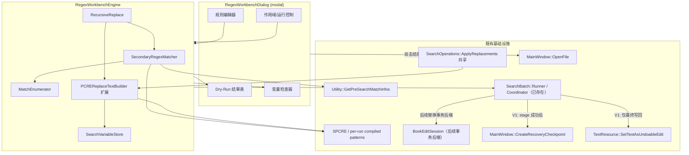
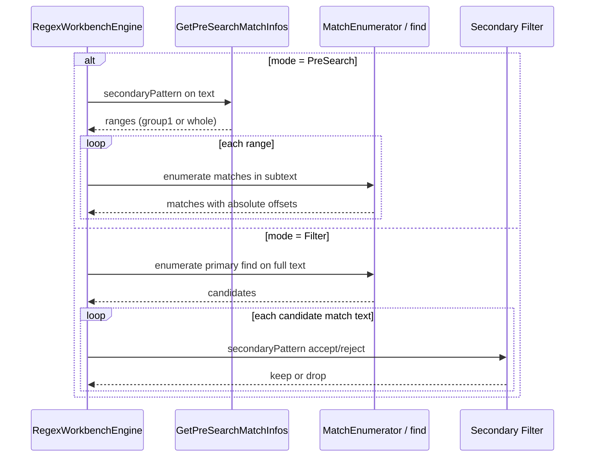
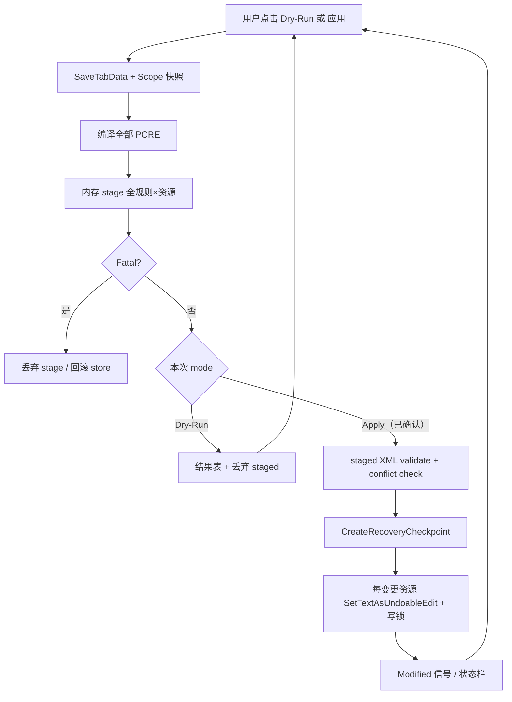
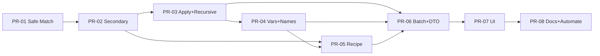

# 高级正则工作台（Advanced Regex Workbench / 正则增强工作台）设计文档

| 字段 | 值 |
| --- | --- |
| **文档标题** | Advanced Regex Workbench（正则增强工作台） |
| **作者** | Sigil-Enhanced 架构组（待填） |
| **日期** | 2026-08-09 |
| **状态** | Draft（修订 5：PR-01–04 核心实现与阶段审计完成；PR-05–08 待推进） |
| **适用仓库** | `sigil-modified` / Sigil-Enhanced |
| **关联计划** | `todo/Sigil-Enhanced-Development-Plan.md` §4 `BookEditSession`、§5 `SearchBatchRunner` |
| **约束文档** | `ENHANCEMENT.md` |

---

## Overview

Sigil-Enhanced 已具备强大的单条/模板搜索能力：`FindReplacePlus` 的 PreSearch 二级匹配、`SearchEditorPlus` 规则库、PCRE2 命名捕获组与 `\g{name}` 回写、`DryRunReplace` / `ReplacementChooser` 预览。但仍缺少一个**面向复杂流水线**的统一工作台，用于：

1. **二级正则（Two-level / Secondary Regex）**：在主匹配结果上再筛选或再搜索，并显式支持 **PreSearch 范围模式** 与 **Filter 接受/拒绝模式**；
2. **递归查找替换（Recursive Find/Replace）**：对同一规则在作用域内循环替换，只有确认当前范围已无匹配才算成功，并带硬安全上限；
3. **命名捕获组变量存储（Named Capture Variable Store）**：跨匹配、跨规则持久化命名捕获值，供后续规则/替换引用（与单次匹配内的 `\g{name}` 严格分离）。

**产品决策**：以「增强插件形态」落地——独立专用对话框/窗口作为主交互面，可保存/导出 recipe（规则集），而不是在现有 Find/Replace 栏上堆叠 checkbox。核心引擎以 C++ 实现并复用既有 PCRE2 / PreSearch / 批量写回基础设施；UI 挂在 `Enhancement` 菜单。

---

## Background & Motivation

### 当前状态

| 能力 | 现状 | 缺口 |
| --- | --- | --- |
| PreSearch 二级匹配 | `Utility::GetPreSearchMatchInfos` / `GetSearchInfoWithPreSearch`（`src/Misc/UtilityExt.cpp`）；`CodeViewEditor::FindNextPreSearch` / `FindNextPlus`（`src/ViewEditors/CodeViewEditorExt.cpp`）；`SearchOperations::*Plus`（`src/Misc/SearchOperations.cpp`）；`SearchEditorModelPlus::searchEntry.prefind` + 控件码 **`PS`** | 仅 **范围裁剪** 语义；无「主匹配后按第二正则过滤」的 Filter 模式；无独立可视化工作台 |
| 全局替换 | `PerformGlobalReplace` / `PerformGlobalReplacePlus` **单遍**扫原始文本 | 无法「替换后再匹配」的链式收敛；无迭代上限/零宽前进守卫 |
| 命名组 | `SPCRE::getCaptureStringNumber` + `PCREReplaceTextBuilder` 支持 `\g{name}` / `\g<name>`；裸 `\v` 已是 **垂直制表符 VT (U+000B)** | 仅 **单次匹配内** 回写；无跨匹配/跨规则会话变量；会话变量语法不得破坏现有 `\v` VT |
| 规则批处理 | `SearchBatch::Runner` 与 `SearchBatchCoordinator` 已落地：规则外层/资源内层内存 staging、非变异恢复点、冲突检测、每资源一次可撤销写回 | 变量、Filter、递归、Dry-Run report 和 staged XML 验证尚未纳入 rule/apply contract；`BookEditSession` 仍未落地 |
| 预览 | `DryRunReplace`、`ReplacementChooser`、`ReplacementPreviewPlus` | 面向单条 Find/Replace，不展示多规则流水线、变量快照、递归迭代轨迹 |

### 痛点

1. 复杂清洗（如：先锁定 `<p class="body">…</p>` 再改段落内标点；或多次折叠空白直到稳定）需要在外部脚本或人工多次点击中完成，无法在产品内闭环。
2. 章节号、书名、作者等「先捕获后复用」场景依赖 Python `\F` 函数或手写插件，门槛高且难以 dry-run。
3. 把高级选项塞进 Find 栏会破坏日常 UX，并与 `SearchMode_PreSearch` 控件布局进一步缠结。

### 与路线图的关系

开发计划明确：搜索模板、字体、OpenCC、Agent 应共用「分析—暂存—预览—提交—回滚」基础设施。当前仓库已先行落地 `SearchBatch::Runner` 与 `SearchBatchCoordinator`，因此工作台**从 V1 起复用并泛化现有批处理链路**，不新增平行的多资源 staging/commit adapter：

- V1：复用 runner 的规则顺序与 working-text map；把 coordinator 拆成可复用的 snapshot/stage/validate/commit 边界，使用 `CreateRecoveryCheckpoint()` 和 `SetTextAsUndoableEdit()`；
- 后续：`BookEditSession` 落地时只替换 coordinator 的事务后端，工作台规则引擎与 report contract 不变。

---

## Goals & Non-Goals

### Goals

1. 提供独立 **正则增强工作台** 窗口：规则编辑、Dry-Run 结果表、变量检查器、作用域与运行控制。
2. 实现三种能力的完整语义与安全模型，并有单元测试覆盖。
3. 复用 PCRE2 与 Plus 的替换语义；GUI 线程经典路径继续使用 `PCRECache`，worker 使用 per-run owned pattern，避免共享可变 match data。
4. Recipe 可保存/加载（JSON 为主），可从 `SearchEditorModelPlus` 导入基础条目。
5. 入口符合 `ENHANCEMENT.md`：`Enhancement` 菜单 + 可选 Automate 命令。
6. 中文友好 UI 文案，并满足现有 `zh_CN`、`zh_TW`、`ja` 三个翻译覆盖门禁。

### Non-Goals

1. **不**替换或废弃 `FindReplace` / `FindReplacePlus` / `SearchEditorPlus` 的日常找替路径。
2. **不**用 `\g{name}` 兼做会话变量；语法必须可区分。
3. **不**在 V1 实现完整 AST/管道可视化、条件分支 DSL 或 **skip-if** 规则（V1 仅顺序规则；skip-if 明确推迟，不在类型/UI/recipe 中出现）。
4. **不**把递归默认打开到全局 Find 栏；仅工作台 / recipe 显式开启。
5. **不**依赖 Live Python 作为核心实现；Python 仅可选导出/演示。
6. **不**在本功能内实现 `BookEditSession` 本身（对其消费接口做适配层即可）。
7. **不**在 V1 支持 Python `\F` 函数规则；导入时跳过并警告。

---

## Proposed Design

### 1. 实现形态选型

| 方案 | 描述 | 优劣 |
| --- | --- | --- |
| **A. C++ 对话框 + BuiltinPlugins 引擎（推荐）** | UI：`src/Dialogs/RegexWorkbenchDialog.*`；功能编排：`src/BuiltinPlugins/RegexWorkbench/*`；通用匹配原语：`src/Misc` / `src/PCRE2`；菜单编排在 `MainWindowExt` | 符合 `ENHANCEMENT.md`；与全书 PCRE 批处理同进程；通用原语仍可由 Plus 与工作台共用 |
| B. 纯 Live Python 插件 | 仅插件脚本 | 大范围匹配/替换性能与 dry-run 表格成本高；难以深度复用 PreSearch C++ 路径与 Checkpoint 策略一致性 |
| C. Hybrid：C++ 核心 + 薄插件启动器 | 引擎 C++，入口走 Plugin | 多一层分发；对本功能收益有限 |

**结论：选 A。** 理由与字体子集化（`FontSubsetController` + `FontSubsetDialog`）、中文转换（`ChineseConversion*`）一致：重计算在 C++，UI 只负责配置/预览/确认。

#### 1.1 与 `ENHANCEMENT.md` / 目录惯例的关系

`ENHANCEMENT.md` 明确要求原生增强**核心逻辑**放在 `src/BuiltinPlugins/`。本功能按“功能编排归 BuiltinPlugins、通用原语归既有搜索层”执行：

| 层 | 位置 | 理由 |
| --- | --- | --- |
| 工作台引擎 / 变量 / recipe | `src/BuiltinPlugins/RegexWorkbench/` | 遵守原生增强核心目录约束；不依赖 MainWindow |
| 匹配枚举 / 替换扩展 | `src/Misc/RegexMatchEnumerator.*`、`SearchOperations.*`、`src/PCRE2/*` | Plus 与工作台共享的低层能力，不包含工作台 UI/recipe 语义 |
| 对话框 | `src/Dialogs/RegexWorkbenchDialog.*` | 与 `ChineseConversionDialog`、`FontSubsetDialog` 一致 |
| 菜单编排 | `MainUI`（`MainWindowExt`）+ `main.ui` | 仅入口、确认、进度、snapshot/commit/OpenFile |

**仍遵守 ENHANCEMENT 的部分**：入口仅 `Enhancement` 菜单（不进 Tools/Plugins）；批量显式触发；SaveTabData + Checkpoint；结果可报告。

目录布局：

```text
src/BuiltinPlugins/RegexWorkbench/
  RegexWorkbenchTypes.h          # 规则/结果/配置 POD、RunOptions、DryRunReport
  RegexWorkbenchEngine.h/.cpp    # 单资源/多资源执行、递归、Filter
  SearchVariableStore.h/.cpp     # 跨匹配变量存储
  RegexRecipeStore.h/.cpp        # recipe 序列化
  SecondaryRegexMatcher.h/.cpp   # PreSearch / Filter 统一入口
  RecursiveReplaceGuard.h/.cpp   # 迭代安全守卫

src/Misc/
  RegexMatchEnumerator.h/.cpp    # PCRE2 limits、零宽、UTF 安全枚举
  SearchBatchRunner.h/.cpp       # 已有；扩展 report/cancel contract

src/Dialogs/
  RegexWorkbenchDialog.h/.cpp    # (+ .ui 可选)

src/PCRE2/
  SPCRE.h/.cpp                   # + getCaptureNames()
  PCREReplaceTextBuilder.*       # 可选 `${var:name}` resolver；经典路径不扫描 `$`

src/MainUI/MainWindowExt.cpp     # OpenRegexWorkbench()
src/Form_Files/main.ui           # actionOpenRegexWorkbench
```

### 2. 总体架构



### 3. 能力 (1)：二级正则（Secondary Regex）

#### 3.1 两种子模式

| 子模式 | 语义 | 复用点 |
| --- | --- | --- |
| **PreSearch / 范围模式** | 外层 `secondaryPattern` 找区间；若存在捕获组 1 则用 group 1 作为范围，否则用整匹配；内层 `find` **仅在**这些区间内匹配 | **直接复用** `Utility::GetPreSearchMatchInfos` + `GetSearchInfoWithPreSearch` 及 `SearchOperations::*Plus` 语义（参数即外层 pattern） |
| **Filter / 过滤模式** | 先用主 `find` 得到匹配集合 \(M\)；对每个匹配文本 \(m\)，用 `secondaryPattern` 做 **accept** 或 **reject** 判定 | 主匹配路径同 `MatchEnumerator`（非递归时 `allowEmpty=false`，对齐 `getEveryMatchInfo`）；Filter 是后处理 |



#### 3.2 字段模型：单一 `secondaryPattern`（无 prefind/secondary 双字段）

**存储模型（规范性）**：规则只保留 **一个** 二级模式字符串字段 `secondaryPattern`，由 `SecondaryMode` 解释其含义。

```cpp
// src/BuiltinPlugins/RegexWorkbench/RegexWorkbenchTypes.h
enum class SecondaryMode {
    None,        // 仅主正则；secondaryPattern 必须为空（校验失败若非空）
    PreSearch,   // secondaryPattern = 外层范围正则（≡ 历史 prefind）
    FilterAccept,// secondaryPattern 命中则保留主匹配
    FilterReject // secondaryPattern 命中则丢弃主匹配
};

struct RegexWorkbenchRule {
    QString id;                 // UUID 或稳定名
    QString name;
    QString find;               // 主查找
    QString secondaryPattern;   // PreSearch 外层 或 Filter 谓词；None 时为空
    QString replace;
    SecondaryMode secondaryMode = SecondaryMode::None;
    bool recursive = false;
    int maxIterations = 32;     // 递归时 per-rule 上限
    // 零宽匹配：默认 false（即使 recursive）。仅插入类配方显式打开。
    // 引擎仅在 recursive==true 时允许 allowEmpty==true；非递归强制 false。
    bool allowEmpty = false;
    bool variableExpansionEnabled = false; // 导入现有搜索时必须保持 false
    bool autoIngestNamedCaptures = false; // true：写入全部命名组；见 captureToVar
    QStringList captureToVar;   // 非空：仅写这些命名组（覆盖 auto 列表）；空且 auto=false：不写
    bool enabled = true;
};
```

**校验规则**：

| secondaryMode | secondaryPattern | 行为 |
| --- | --- | --- |
| `None` | 必须空 | 忽略二级 |
| `PreSearch` | 必须非空 | 作外层范围（语义 = 旧 `prefind`） |
| `FilterAccept` / `FilterReject` | 必须非空 | 作过滤谓词 |

**禁止**再存一份平行的 `prefind` 字段，避免 UI/JSON 双源漂移。

**从 Search 模板导入**（`SearchEditorModelPlus::searchEntry`）：

```text
if controls 含 token "PS"（精确子串/控件码，与 FindReplacePlus 一致：NL / RX / PS）
   且 !entry.prefind.isEmpty():
    secondaryMode = PreSearch
    secondaryPattern = entry.prefind
else:
    secondaryMode = None
    secondaryPattern = ""   // 即使 prefind 有值也忽略（与栏上非 PreSearch 模式一致）
find / replace / name 原样映射
recursive / 变量相关 = 默认关
```

UI 将 PreSearch 与 Filter **分开展示**（模式选择器切换 `secondaryPattern` 标签文案：「预搜索范围」vs「过滤正则」）。

#### 3.3 与 Find 栏的关系

- `FindReplacePlus` **保持不变**；不强制在栏上增加 Filter。
- 工作台 Dry-Run 可「发送当前规则到 Find 栏」（可选，V2），构造 `searchEntry`（PreSearch 时写回 `prefind` + controls `PS`）再 `LoadSearch`。

#### 3.4 递归时的 Filter / PreSearch 重求值

**规范性**：`recursive == true` 时，**每一次** `ApplyOnce` 都在**当前迭代文本**上重新执行完整的 `SecondaryRegexMatcher`（含 PreSearch 范围或 FilterAccept/Reject）。不得缓存第一遍的匹配列表跨迭代复用。

- PreSearch 外层捕获组 **不**自动写入 store（与现网 PreSearch 一致：外层只定范围）；仅内层 `find` 的命名组可在 ApplyOnce 中 ingest。

#### 3.5 Filter 二级 ingest 时序（相对 primary expand）

对 `FilterAccept` / `FilterReject`，枚举阶段只做**无副作用**的候选筛选，并把该候选自己的 Filter match 携带到 `ApplyOnce`。Filter 在主匹配文本上做非锚定搜索；若有多个结果，V1 使用最左侧第一个结果及其捕获。

```text
candidates = Enumerate(primary find, text, allowEmpty=rule effective)
kept = []
for each candidate c in left-to-right order:
    filt = firstMatch(secondaryPattern, c.matchText)    // 纯读取，不写 store
    if not kept_by_mode(filt):
        continue
    kept.append({ primary: c, filter: filt })

ApplyOnce(text, kept, store):
    for each kept candidate k:
        if k.filter matched and rule allows Filter ingest:
            ingest k.filter captures into the active variable frame
        expand replacement for k.primary       // 可见“同一候选”的 Filter 捕获
        ingest k.primary captures              // 供后续候选/规则使用
```

**推论**：

- 替换串中的变量引用可以读到 **同一候选** 上 Filter 刚写入的值；后续候选不会提前污染 store。
- 被拒绝的候选既不进入 `kept`，也不污染 store。
- 主匹配自己的命名组仍按 §5.5 在 **expand 之后** ingest（供后续匹配/规则使用）。
- `FilterReject` 保留下来的候选按定义没有 Filter match，因此没有 Filter 捕获可 ingest。

### 4. 能力 (2)：递归查找替换

#### 4.1 语义

对**单条规则**在**单资源文本**上：

```text
original = input
text = input
appliedIterations = 0
seenStates = { hash(text, activeVariableFrame) }

while true:
    candidates = EnumerateAndFilter(rule, text)       // 无 store 写副作用
    if candidates.empty:
        return Success(NoMatches, text)
    if appliedIterations >= maxIterations:
        abort Fatal(IterationLimit)

    beforeState = hash(text, activeVariableFrame)
    text', count = ApplyOnce(rule, text, candidates, store)
    guard.checkAgainstOriginal(original, text', count)
    afterState = hash(text', activeVariableFrame)

    if afterState == beforeState:
        abort Fatal(StalledWithMatches)
    if seenStates contains afterState:
        abort Fatal(StateCycle)

    seenStates += afterState
    text = text'
    appliedIterations += 1
```

只有 `NoMatches` 是递归成功终止。`StalledWithMatches`、`StateCycle`、`IterationLimit` 都说明需求“替换到没有匹配项”未完成，必须丢弃整批 stage，不得伪装成收敛成功。最大迭代数表示**允许执行的修改轮数**；最后一轮之后必须再做一次只读枚举，因此 `maxIterations=1` 的一次清除型规则可以正常成功。

- **全局（多资源）递归**：资源间顺序固定；每资源独立收敛后再进入下一资源。**不做**「全书共享一个迭代计数器跨资源回扫」。
- **多规则**：规则按顺序；规则 A 收敛后再执行规则 B。
- **Store 跨迭代**：同一规则的多次迭代共享 active variable frame。Resource scope 使用 `bookpath → frame` 映射；Batch/Session 使用对应全局 frame。迭代 *i* 写入的变量对迭代 *i+1* 可见。

#### 4.2 安全守卫（`RecursiveReplaceGuard`）

| 守卫 | 默认 | 行为 |
| --- | --- | --- |
| `maxIterations` | 32 / 规则 | 超限 → **Fatal abort**（见 §6.1），丢弃整批 stage |
| `maxTotalReplacements` | 100_000 / 规则·资源 | 累计超限 → Fatal abort |
| `maxTextGrowthFactor` | 4.0 + 绝对地板 | 始终相对本规则进入该资源时的 original text 计算 |
| `maxTextCodeUnits` | 64 Mi UTF-16 units / 资源 | 绝对硬上限；配置只能调低，不能由 recipe 调高 |
| 零宽匹配前进 | 强制 | 同 offset 先重试非空替代，再按 Unicode code point / CRLF 前进 |
| 无进展/循环 | 强制 | 仍有匹配时 state 不变或重复 → Fatal |
| 用户取消 | `RunOptions.cancel` | 规则/资源边界检查 → Fatal abort（同丢弃 stage） |

**`maxTextGrowthFactor` 复合条件（规范性）**：

```text
growthLimit = max(
    originalLen * maxTextGrowthFactor,
    originalLen + maxAbsoluteGrowthCodeUnits        // 默认 1 Mi UTF-16 units
)
abort_growth = newLen > growthLimit || newLen > maxTextCodeUnits
```

- 复合阈值等价于旧设计的 AND 意图，但基线固定为 original，避免每轮低于 4× 却指数膨胀。
- 单位统一为 QString UTF-16 code unit，不再把字符长度误称为 bytes。
- 金样：100 units → 500 units 不 abort；2 Mi units → 9 Mi units abort；每轮 2× 的连续增长也会被 original 基线或绝对上限拦住。

**V1 不提供「可配置半状态提交」**。守卫触发、无进展、状态循环均为 Fatal；仅确认 `NoMatches` 为成功退出。

#### 4.3 ApplyOnce 与 MatchEnumerator（含空匹配）

**单遍契约（对齐 Plus，非 classic）**：

1. 在**当前完整文本**（或 PreSearch 子范围拼出的逻辑视图）上 **先枚举全部匹配**；
2. 再 **从左到右** splice 生成新文本（与 `PerformGlobalReplacePlus` 相同结构）；
3. **禁止**「替换一个就立刻在新文本上 rescan」作为单次 `ApplyOnce` 的内部行为（那是外层递归的职责）。

现有 `SPCRE::getEveryMatchInfo` 使用 `PCRE2_NOTEMPTY` 且丢弃 `ovector[0]==ovector[1]`。引擎使用私有 `MatchEnumerator`，**不修改**全局 `getEveryMatchInfo` 行为。

```cpp
struct MatchOptions {
    bool allowEmpty = false;          // 默认 false；仅 recursive && rule.allowEmpty 时 true
    bool requireForwardProgress = true;
};

// 伪代码：在 haystack[from, to) 上枚举（to 为开区间终点）
// 偏移是 QString UTF-16 code unit 下标，但前进不得落入 surrogate pair 中间
function Enumerate(pattern, haystack, from, to, opts) -> List<MatchInfo>:
    matches = []
    start = from
    retryNonEmptyAtSameOffset = false
    while start <= to:
        flags = retryNonEmptyAtSameOffset
            ? PCRE2_ANCHORED | PCRE2_NOTEMPTY_ATSTART
            : 0
        rc, m = pcre2_match(..., start, flags, boundedMatchContext)
        if rc == PCRE2_ERROR_NOMATCH and retryNonEmptyAtSameOffset:
            if start == to: break
            start = AdvanceOneUnicodeCodePointOrCRLF(haystack, start, to)
            retryNonEmptyAtSameOffset = false
            continue
        if rc == PCRE2_ERROR_NOMATCH: break
        if rc < 0: return Fatal(MapPcreError(rc))
        abs_start, abs_end = m.offsets
        if abs_start > to: break
        if abs_end > to: return Fatal(MatchCrossedRangeBoundary)
        is_empty = (abs_start == abs_end)
        if is_empty:
            if opts.allowEmpty: matches.append(m)
            start = abs_end
            retryNonEmptyAtSameOffset = true
        else:
            matches.append(m)
            start = abs_end
            retryNonEmptyAtSameOffset = false
    return matches
```

**PreSearch 范围边界**：

- 每个 range `[R0,R1)` 内独立 `Enumerate`；内层偏移加 `R0` 映射回全文。
- 在 `R1` 处的零宽匹配最多下发一次；同位置非空重试失败后直接退出范围，不前进到范围外。
- PreSearch 外层 range 枚举必须用**外层完整匹配末端**推进；group 1 未参与或为空时跳过该 range 但仍推进，禁止沿 group 1 末端重搜导致死循环/重叠。

**递归 + 空匹配插入**：

- **默认 `rule.allowEmpty = false`**，即使 `recursive == true`。`\s*` / `.*` 等模式在递归下不会默认产生海量零宽命中。
- 有效策略：`effectiveAllowEmpty = rule.recursive && rule.allowEmpty`。非递归强制 `false`（对齐 Plus / `getEveryMatchInfo`）。
- UI：递归开启时显示复选框「允许零宽匹配（插入类）」，**默认关**；recipe JSON 字段 `allowEmpty`（默认 `false`）。
- 若替换串与变量 frame 都不变但匹配仍存在，返回 `StalledWithMatches` Fatal；不会标成成功。
- 金样：非递归路径 `allowEmpty=false`，与 `PerformGlobalReplacePlus` **逐字节一致**（工作台目标是 Plus 语义，不是 classic `PerformGlobalReplace` 的 reverse 构建）。

#### 4.4 共享 `ApplyReplacements`（禁止长期平行分叉）

**PR-02 必须**从 `PerformGlobalReplacePlus` **抽取**纯函数，由 Plus 与工作台共同调用。

**变量 resolver 与逐匹配回调必须贯通到 builder（规范性）**：

现网路径：`SearchOperations` → `spcre->replaceText(...)` → `PCREReplaceTextBuilder::BuildReplacementText(...)`，且 `SPCRE::replaceText` 在整串为 `\F<name>` 时走 Python 分支。共享函数的默认 options 必须完整保留该路径。

工作台需要在每个 primary match 上实现 “Filter ingest → expand → primary ingest”，因此共享函数提供通用 before/after callback 和只读 resolver；这些类型不能依赖 `SearchVariableStore`。

```cpp
struct ApplyReplacementsOptions {
    VariableResolver resolver;            // 空 = 经典路径，不扫描 ${var:...}
    MatchCallback beforeExpand;           // 工作台：ingest 当前候选 Filter 捕获
    MatchCallback afterExpand;            // 工作台：ingest 当前 primary 捕获
};

// 规范顺序：beforeExpand → replaceText(resolver) → afterExpand
std::tuple<QString, int> ApplyReplacements(
    const QString& text,
    SPCRE* spcre,
    const QList<Utility::MatchInfo>& matches,
    const QString& replacement,
    const ApplyReplacementsOptions& opts = {});
```

若抽取因 diff 风险需拆 PR：允许先放共享函数 + 改 Plus 调用（callbacks/resolver 均空），再贯通工作台 store；**不允许**引擎内永久保留平行 splice 实现。共享金样放在 `tests/fixtures/regex_apply/`。

### 5. 能力 (3)：命名捕获组变量存储

#### 5.1 分层

| 层 | 含义 | 现状 |
| --- | --- | --- |
| **A. 匹配内命名组** | PCRE2 named groups + 替换 `\g{name}` / `\g<name>` | **已有** |
| **B. 同规则多匹配 / 多迭代** | 由 store + §5.5 顺序定义 | 新增 |
| **C. 跨规则 / 会话** | recipe 一次运行或窗口 Session | **新增** `SearchVariableStore` |

#### 5.2 语法：`${var:name}` + 显式启用（不复用 `\v`）

**代码事实**：裸 `\v` 是垂直制表符 VT；历史 `\v{foo}` 会得到 VT + 字面量 `{foo}`。仅用“store 指针是否为空”门控会让导入工作台的旧 replacement 在工作台路径中改变含义，因此 V4 放弃 `\v{name}`。

V1 会话变量读取语法固定为 `${var:name}`，并要求规则显式设置 `variableExpansionEnabled=true`：

| 输入 | `variableExpansionEnabled=false` | `variableExpansionEnabled=true` |
| --- | --- | --- |
| `\v` / `\v{foo}` | 完全保持现网：VT / VT+`{foo}` | 仍完全保持现网 |
| `\g{name}` / `\g<name>` | 当前匹配命名组 | 当前匹配命名组 |
| `${var:name}` | 字面量，不解析 | 从 active variable frame 读取 `name` |
| `${name}` | 字面量 | 字面量；V1 必须带 `var:` 命名空间 |

导入 SearchEditor/Plus 条目时 `variableExpansionEnabled` 必须为 false。Recipe 新建规则也默认 false；用户启用变量展开或通过 UI“插入变量”后才置 true。未定义变量在 V1 是 `UndefinedVariable` Fatal，不允许静默替换为空串；Dry-Run 定位规则、资源和变量名，Apply 保证零写入。

实现不把 `SearchVariableStore` 类型下沉到 PCRE 层。`PCREReplaceTextBuilder` 接受一个可选、只读的通用 resolver callback；resolver 为空时不扫描 `$`，保持经典路径逐字符一致。resolver 返回的值作为**字面 replacement segment**注入，不二次解释其中的反斜杠控制符。

**金样（强制）**：

| 用例 | 变量展开 | 期望 |
| --- | --- | --- |
| `\v` / `\v{foo}` | 关/开 | 与现网一致 |
| `${var:foo}` | 关 | 字面量 `${var:foo}` |
| `${var:foo}`，foo=bar | 开 | `bar` |
| `${var:missing}` | 开 | Fatal，零 staged publication |
| `\g{1}` + `${var:x}` | 开 | group1 文本 + store[x] |
| store 值为 `\g{1}` | 开 | 字面量 `\g{1}`，不做二次 backreference 展开 |

#### 5.3 命名组枚举 API（`SPCRE`）

自动 ingest「本次匹配的所有命名组」需要 **name → number 表枚举**。现状仅有 `getCaptureStringNumber(name)`。

**新增**（PR-03）：

```cpp
// SPCRE.h
// 返回模式中声明的命名捕获组名称列表（不含纯数字组）。
// 实现：PCRE2_INFO_NAMECOUNT / NAMEENTRYSIZE / NAMETABLE。
// DUPNAMES：每个 name 出现一次（与 getCaptureStringNumber 解析一致）。
// 无名模式：返回空列表。
QStringList getCaptureNames() const;
```

- 自动 ingest **只写命名组**，不写 `$1` 式匿名组。
- 单测：无命名；单命名；多命名；（若构建启用）重复名策略与 `getCaptureStringNumber` 一致。

#### 5.4 `SearchVariableStore`

```cpp
enum class VariableScope {
    Resource,  // bookpath → 独立 frame；跨规则保留，运行结束清除
    Batch,     // 一次 recipe 运行、跨资源保留；运行结束可丢弃（除非 Session）
    Session    // 对话框存活期间保留；换 Book 时强制 clear()；用户可 Clear
};

enum class WritePolicy {
    LastWins,   // 默认
    FirstOnly,
    Append      // QStringList 累积
};

class SearchVariableStore {
public:
    void setScope(VariableScope s);
    void setWritePolicy(WritePolicy p);
    void clear();
    void setActiveResource(const QString& bookpath);
    void clearRunLocals();

    bool has(const QString& name) const;
    QString get(const QString& name, bool* found = nullptr) const;
    QStringList getList(const QString& name) const;

    // onlyNames 空：写入 re.getCaptureNames() 中全部有值的组
    // onlyNames 非空：仅这些名
    void ingestNamedCaptures(SPCRE& re,
                             const QString& matchText,
                             const QList<std::pair<int,int>>& caps,
                             const QStringList& onlyNames = {});

    VariableStoreSnapshot snapshot() const; // 包含 resource/batch/session 全部 frame
    // ...
};
```

**安全**：

- 变量名：`[A-Za-z_][A-Za-z0-9_]{0,63}`。
- 单值默认 ≤ 64 KiB；store 总量默认 ≤ 4 MiB。
- `Append` 下 resolver 展开最新一项；`getList()` / 变量检查器可查看完整序列。
- 未参与匹配的命名组不写入；参与但捕获空串的命名组写入空值。
- V1 检测到 duplicate names 时编译失败；不猜测多个同名组中哪一个参与。
- Dry-Run 使用 **影子 store**；默认不写回 Session 真值（除非用户勾选「预览后保留变量」）。
- Apply Fatal abort：丢弃本次运行对 Batch store 的修改（恢复运行前快照）；Session 真值在 Apply 开始前快照，失败则回滚。

#### 5.5 单遍内变量顺序（规范性 · 解决歧义）

对 `ApplyOnce` 中**已枚举**的匹配列表，**从左到右**对每个 match \(m_i\)：

```text
(a) 使用「处理 m_i 之前」的 store 快照扩展 replacement
    （\g 来自 m_i 的 capture_groups；`${var:…}` 来自 store-before-m_i）
(b) 将扩展结果拼入输出（与 head 文本拼接，同 Plus）
(c) 再按规则配置 ingest m_i 的命名组到 store（WritePolicy 生效）
```

**不是**「先 ingest 全部匹配再统一 expand」。
**不是**「先 expand 全部再统一 ingest」。

**推论**：

- 同规则内，后面的匹配可以看到前面匹配刚写入的变量（LastWins 下为最新值）。
- 下一条规则看到上一条规则全部匹配处理完后的 store。
- 递归迭代 *i+1* 看到迭代 *i* 结束后的 store。

**写 store 配置**：

| autoIngestNamedCaptures | captureToVar | 行为 |
| --- | --- | --- |
| false | 空 | 不 ingest |
| true | 空 | ingest `getCaptureNames()` 全部 |
| * | 非空 | 仅 ingest 列表中的名（忽略 auto 布尔的「全部」含义，列表优先） |

#### 5.6 替换构建扩展

```cpp
bool BuildReplacementText(SPCRE &sre,
                          const QString &text,
                          const QList<std::pair<int, int>> &capture_groups_offsets,
                          const QString &replacement_pattern,
                          QString &out,
                          const VariableResolver& resolver = {});
```

- resolver 为空：与现网严格 bit-identical；不扫描 `$`，`SPCRE::replaceText` 的 `\F<name>` Python 分支不变。
- resolver 非空：仅额外解析 `${var:name}`；裸 `\v`、`\g`、大小写/宽度控制不变。工作台在编译规则阶段拒绝整串 `\F<function>`，而不是靠 resolver 是否存在改变 `SPCRE` 分支。

### 6. 引擎执行流水线

#### 6.1 V1 写回与 Abort 策略（规范性）

**原则：GUI 线程快照 → worker 完整 stage/validate → GUI 线程非变异 Checkpoint/冲突复核/可撤销写回；Fatal 永不留下半改书籍。**

**Dry-Run 与 Apply 独立重跑（规范性）**：UI 上 **[Dry-Run]** 与 **[应用]** 是两次独立的引擎调用。每一次都从**当前**书籍文本 + **当前**规则列表重新执行 `SaveTabData`（或等价的资源再读）→ 编译 → 完整内存 stage。**Apply 禁止复用**上一次 Dry-Run 的 `staged` map 或 report 行偏移（用户可能在两次点击之间改规则/recipe/书籍）。Dry-Run 结束后丢弃其 stage；Apply 自行再 stage。

**单次引擎运行**（Dry-Run 或 Apply 各自一次）：

```text
1. 若 mode == Apply：先显示确认；确认后冻结规则编辑，随后才开始本次独立运行
2. GUI thread: SaveTabData()，固定有序 resourcePaths，复制 original texts/fingerprint
3. Worker thread:
     a. 为本次 run 独占编译全部 primary/secondary PCRE 和 bounded match context
     b. 调用/扩展 SearchBatch::Runner：rule outer / ordered resourcePaths inner
     c. 维护 workingTexts、变量 frame、递归状态与 capped DryRunReport
     d. 在规则/资源/迭代/匹配枚举中检查 atomic cancel
     e. 验证 staged XHTML/OPF/NCX/SVG/XML well-formed
     f. 任意 Fatal：丢弃 changedTexts/report publication，恢复 store snapshot
4. 若 mode == Dry-Run：
     GUI thread 展示 report；不 checkpoint、不 commit；shadow store 默认不发布
5. 若 mode == Apply：
     a. 若 changedTexts 为空 → 提示无变更
     b. GUI thread 对 original fingerprint 做 conflict check
     c. CreateRecoveryCheckpoint() 一次；失败 → 零写回
     d. checkpoint 后再次 conflict check
     e. 按稳定 resourcePaths 顺序逐资源 SetTextAsUndoableEdit(finalText)
     f. postcondition 失败时沿用 coordinator 的 appliedPaths 逆序 fail-safe rollback
     g. Book modified/当前 tab refresh 各汇总一次
```

| 场景 | Checkpoint | Resource writes | staged |
| --- | --- | --- | --- |
| Dry-Run 成功 | 否 | 否 | 仅内存，**丢弃**（下次 Apply 不复用） |
| Stage 中 Fatal（守卫/取消/编译） | 否 | 否 | 丢弃 |
| staged XML 验证失败 | 否 | 否 | 丢弃 |
| Recovery checkpoint 失败 | 否（未创建成功） | 否 | 丢弃 |
| Apply 成功 | 是（写前一次） | 仅变更资源各一次 | 提交后丢弃 |
| Commit postcondition 失败 | 已有 Checkpoint | fail-safe 恢复 original | 报 Fatal；必要时可 Checkout |

**Undo 语义（明示）**：

- 成功 Apply 通过 `SetTextAsUndoableEdit()` 为每个 changed resource 建立一个全文撤销步骤，并保留该文档更早的 undo history；
- Qt undo stack 属于各自 `TextResource`，不存在跨多个资源的全局原子 Ctrl+Z；
- 当前标签页可立即撤销本资源，其他资源在对应文档中各自撤销；整书原子恢复使用本批次的 Checkpoint；
- 极少见的 commit postcondition fail-safe rollback 使用装载式原文恢复，失败批次不承诺保留对应 undo stack。

#### 6.2 流水线示意



#### 6.3 进度、取消与锁

```cpp
struct RunOptions {
    std::atomic_bool* cancel = nullptr;  // worker 读取；GUI Cancel 可正常处理点击
    ProgressCallback progress;           // worker 发值；adapter 用 queued signal 更新 UI
    int maxIterationsDefault = 32;
    uint32_t pcreMatchLimit = ...;
    uint32_t pcreDepthLimit = ...;
    int maxReportRows = 10'000;
    int maxSnippetCodeUnits = 240;
    qint64 maxRunReplacements = 1'000'000;
    // ...
};

struct DryRunReport {
    struct Row {
        QString ruleId;
        QString ruleName;
        QString bookpath;
        int matchStart = -1;
        int matchEnd = -1;
        int lineHint = -1;       // 1-based 若可计算，否则 -1
        int iteration = 0;       // 递归迭代号，从 1；非递归 1
        CoordinateSpace coordinateSpace = CoordinateSpace::Snapshot;
        bool exactNavigationAvailable = true;
        QString beforeSnippet;
        QString afterSnippet;
        QHash<QString, QString> varDelta; // 本行相关变量变更（可选）
        bool isWarning = false;
        QString warningText;
    };
    QList<Row> rows;
    int totalMatches = 0;
    int totalReplacements = 0;
    int changedResourceCount = 0;
    bool fatal = false;
    QString fatalMessage;
    QHash<QString, QString> finalVariables;
    QStringList warnings;
    bool rowsTruncated = false;
    qint64 omittedRowCount = 0;
};
```

- **取消检查点**：每条规则、每个资源、每次递归迭代，以及 MatchEnumerator 全局枚举之间；单次 PCRE 调用还受 match/depth limit 约束。
- **UI**：stage 在 worker 执行，不调用嵌套 `processEvents()`；GUI event loop 正常处理唯一可用的 Cancel 和绘制事件。
- **PCRE 所有权**：worker 使用 per-run owned compiled patterns/match data/context；不得持有 `PCRECache` 裸指针跨规则预编译，也不得跨线程使用缓存中的可变 `SPCRE`。
- **锁**：GUI snapshot 阶段短持有读锁并复制 QString；worker 不接触 Resource/QTextDocument；写锁只在最终 GUI commit 逐资源持有。
- **报告上限**：计数始终精确，但 rows/snippets 有硬上限；超限仅截断明细并记录 omitted count，不允许 report 自身耗尽内存。
- **导航**：递归中间态 offset 标为 `Intermediate`，不得用于最终文档精确跳转。Dry-Run snapshot 行只有在 resource fingerprint 未变化时可精确导航；Apply 后仅 final-coordinate 行可带 position，其余只打开资源。

#### 6.4 V2

`BookEditSession` 落地后替换 coordinator 的 commit backend；runner、工作台引擎、变量语义和 report DTO 不变。

### 7. UI 设计

#### 7.1 UI 集成契约（规范性）

| 项 | 决定 |
| --- | --- |
| **模态** | **模态** `QDialog::exec()`（对齐 `ChineseConversionDialog` / `FontSubsetDialog`）。V1 **不做** modeless 长驻窗口，避免与书籍并发编辑的安全模型复杂化。 |
| **父对象 / 生命周期** | `parent = MainWindow`；**栈上** `RegexWorkbenchDialog dlg(this); dlg.exec();`，与 `FontSubsetDialog` / `ChineseConversionDialog` 一致。**不**设置 `WA_DeleteOnClose`（避免栈对象被 Qt 再 `delete` 导致 double-free）。**不**使用长期堆分配 + DeleteOnClose（那是 `DryRunReplace` 一类路径，不适用于本模态工作台）。 |
| **成员指针** | **不**在 MainWindow 持有 `m_RegexWorkbench`；每次菜单打开一次完整会话。 |
| **定位匹配** | 结果行双击 → `MainWindow::OpenFile(bookpath, lineHint, matchStart)`（`MainWindow.h` 公开 API）。**不要**调用 `FindReplacePlus::EmitOpenFileRequest`（那是 Find 栏内部信号）。`position` 优先用 match 起始 UTF-16 偏移；`line == -1` 时由 OpenFile 现有逻辑处理。 |
| **Apply 后对话框** | 保持打开，刷新结果表为「已应用」摘要；变量检查器显示最终 store；用户可继续 Dry-Run 或关闭。 |
| **Checkpoint 文案** | 写前状态栏提示 Creating checkpoint…；失败则 **不写回**，QMessageBox 与中文转换/字体子集化同级措辞。 |
| **Undo 提示** | Apply 成功后注明：每个文件可分别 Undo；整批跨文件恢复请用本次 Checkpoint。 |
| **Feature flag** | `SettingsStore` 键 `enhanced/regex_workbench_enabled`（默认 true）；PR-06 接线：false 时隐藏菜单 action。 |
| **换书** | 若将来改为 modeless 才需监听；模态下换书需先关对话框。Session 变量在每次 `OpenRegexWorkbench` 可选择恢复上次 Session（V1：每次打开新 store，Session 仅指单次对话框生命周期内多次 Run）。 |

**Session 澄清（V1）**：`VariableScope::Session` = **同一次对话框 `exec()` 期间**多次 Dry-Run/Apply 之间保留；关闭对话框即销毁。换 Book 不会在模态对话框仍打开时发生（主窗口被模态阻塞）。

#### 7.2 入口

- 菜单：`Enhancement` → `正则增强工作台...` / `Advanced Regex Workbench...`
- Action：`actionOpenRegexWorkbench`
- 槽：`MainWindow::OpenRegexWorkbench()`（`MainWindowExt.cpp`）
- 可选 Automate（PR-08）：`OpenRegexWorkbench`

#### 7.3 窗口布局

```text
+------------------------------------------------------------------+
| 文件: 新建 | 打开 Recipe | 保存 | 导入搜索模板 | 导出            |
+------------------+------------------------+----------------------+
| 规则列表         | 规则编辑               | 运行控制             |
| (可排序/启用)    | 名称                   | 作用域: 当前/选中/   |
|                  | 二级模式: PreSearch ▼  |   全部HTML/CSS/...   |
|                  | 二级正则: ...          | 变量作用域: Batch ▼  |
|                  | find / replace         | 写策略: LastWins ▼   |
|                  | ☑ 递归  最大迭代 [32]  | [Dry-Run] [应用]     |
|                  | ☐ 允许零宽匹配(插入类) | [清空变量] [取消]    |
|                  | ☑ 自动写入命名捕获     |                      |
+------------------+------------------------+----------------------+
| Dry-Run 结果表                                               [过滤] |
| 规则 | 资源 | 行 | 匹配前 | 匹配后 | 迭代# | 警告                  |
+------------------------------------------------------------------+
| 变量检查器: name | value | lastRule                                |
+------------------------------------------------------------------+
| 状态: 匹配 120 / 将修改 8 文件 / 警告 2                            |
+------------------------------------------------------------------+
```

### 7.4 与既有对话框

| 既有 | 关系 |
| --- | --- |
| `DryRunReplace` | 参考 context 截取；工作台用自有 `DryRunReport` 模型 |
| `ReplacementChooser` | V1 不做部分勾选应用 |
| `SearchEditorPlus` | 导入源；控件码 **`PS`** |
| `ChineseConversionDialog` / `FontSubsetDialog` | 模态、Checkpoint、失败不写 的范式来源 |

### 8. Recipe 持久化

**格式**：JSON，`format: "sigil.regexWorkbench.recipe"`，version 1。
**路径**：`Utility::DefinePrefsDir() + "/regex_workbench/"`（与 `SearchEditorModelPlus` 使用 `DefinePrefsDir()` 一致；跨平台）。首次保存时 `mkpath`。

```json
{
  "format": "sigil.regexWorkbench.recipe",
  "version": 1,
  "name": "正文标点清洗",
  "variableScope": "Batch",
  "writePolicy": "LastWins",
  "rules": [
    {
      "id": "r1",
      "name": "锁定段落内折叠逗号",
      "secondaryMode": "PreSearch",
      "secondaryPattern": "<p class=\"body\">([\\s\\S]*?)</p>",
      "find": "，+",
      "replace": "，",
      "recursive": true,
      "maxIterations": 16,
      "allowEmpty": false,
      "variableExpansionEnabled": false,
      "autoIngestNamedCaptures": false,
      "captureToVar": [],
      "enabled": true
    },
    {
      "id": "r2",
      "name": "抽取书名",
      "secondaryMode": "None",
      "secondaryPattern": "",
      "find": "<dc:title[^>]*>(?<booktitle>[^<]+)</dc:title>",
      "replace": "\\0",
      "variableExpansionEnabled": false,
      "captureToVar": ["booktitle"],
      "recursive": false
    }
  ]
}
```

导入 `searchEntry`：见 §3.2（`PS` + `prefind` → `secondaryPattern`）。
导出回 Search Editor：仅 `name/find/replace/prefind/controls`；丢失递归/Filter/变量时警告。

`SettingsStore` 键：

- `regex_workbench/geometry`
- `regex_workbench/last_recipe_path`
- `regex_workbench/default_max_iterations`
- `enhanced/regex_workbench_enabled`

---

## API / Interface Changes

### 新增

- `RegexWorkbenchRule`、`SecondaryMode`、`SearchVariableStore`、`RegexWorkbenchEngine`、`DryRunReport`、`RunOptions`、`MatchEnumerator`。

### `SPCRE`

- `QStringList getCaptureNames() const;`

### `PCREReplaceTextBuilder`

- 可选通用 `VariableResolver`；仅 resolver 非空时识别 `${var:name}`；裸 `\v`、`\v{foo}` 和 resolver 为空的所有 replacement 保持现网行为。

### `SearchOperations`

- 抽取 `ApplyReplacements`；`PerformGlobalReplacePlus` 改为调用它。

### `SearchBatch::Rule` / coordinator（V1 即接入）

```cpp
SecondaryMode secondaryMode = SecondaryMode::None;
QString secondaryPattern;  // 取代仅 preSearchText 的扩展位：可与 preSearchText 合并迁移
bool recursive = false;
int maxIterations = 32;
bool variableExpansionEnabled = false;
bool autoIngestNamedCaptures = false;
QStringList captureToVar;
```

不要求把所有工作台类型直接塞进通用 `SearchBatch::Rule`。允许 rule 保存稳定 `executorId`，由 ApplyFunction 闭包持有已编译的工作台规则；但 snapshot、workingTexts、取消、changedTexts publication 和 commit 必须复用现有 runner/coordinator。coordinator 需拆出 GUI-thread `CaptureSnapshot` 与 `CommitStagedResult`，供 Dry-Run/worker stage 使用，现有保存搜索 `Run()` 保留为兼容包装。

### MainWindow

```cpp
void OpenRegexWorkbench();  // 无长期 dialog 成员
// 导航使用已有：void OpenFile(QString file_bookpath, int line = -1, int position = -1);
```

---

## Data Model Changes

- 无 EPUB/OPF schema 变更。
- 用户级 recipe 目录：`DefinePrefsDir()/regex_workbench/`。
- Settings 键见 §8。

---

## Alternatives Considered

### Alt-1：仅在 `FindReplacePlus` 增加选项

否决：违背产品决策；膨胀 Find 栏。

### Alt-2：纯 Live Python 工作台

否决为 V1 核心；可后续 recipe→插件导出。

### Alt-3：使用 `\v{name}` 或 `\V{name}`

否决。`\v` 已有 VT 语义；仅按 store 指针门控仍会改变导入工作台的经典 replacement。`\V` 在 regex 语境也有既有含义，易混淆。V1 使用显式、带命名空间且按规则 opt-in 的 `${var:name}`。

### Alt-4：递归作为全局 ReplaceAll 默认

否决：破坏单遍契约。

### Alt-5：Checkpoint 先于 stage

不采用。先 stage 可避免“Checkpoint 已建但用户因 Fatal 未改书”的噪音；Apply 确认在本次独立 run 前完成，stage/validate 成功后再 `CreateRecoveryCheckpoint()`，随后二次冲突检查并 commit。

---

## Security & Privacy Considerations

| 威胁 | 严重度 | 缓解 |
| --- | --- | --- |
| 灾难性回溯 | 高 | per-run PCRE match/depth/heap limits；worker；错误码分类；匹配间检查 cancel |
| 递归膨胀 | 高 | original-relative growth、绝对文本/替换总量、迭代上限；先 stage |
| 零宽死循环 | 高 | PCRE2 同 offset 非空重试；Unicode/CRLF 前进；状态循环检测 |
| 半改书籍 | 高 | Fatal 丢弃 stage；非变异 recovery checkpoint；coordinator postcondition rollback |
| 变量注入超大串 | 中 | 长度/总量 cap |
| 并发写 | 中 | GUI snapshot/commit；worker 只持 QString；提交前后 conflict check |
| 畸形 EPUB 标记 | 高 | staged XHTML/OPF/NCX/SVG/XML well-formed 验证在 checkpoint 前完成 |
| 报告内存耗尽 | 中 | row/snippet/run replacement 硬上限；计数与明细截断分离 |

---

## Observability

- Debug：`qDebug` 规则 id、迭代、abort 原因。
- 状态栏：匹配数、修改文件数、Checkpoint/警告。
- `DryRunReport` 在行数上限内可追溯；超限保留精确总数与 omitted count。
- 可选本地 metrics：`duration_ms`、`match_count`、`replace_count`、`iteration_count`。

---

## Rollout Plan

| 阶段 | 内容 |
| --- | --- |
| PR-01–07 | 安全匹配基础→Filter→递归→变量→batch→UI；开发期 flag 默认 false |
| 紧急关闭 | `enhanced/regex_workbench_enabled=false` |
| 回滚书籍 | Checkpoint Checkout |
| 后续事务替换 | BookEditSession 就绪后只替换 coordinator backend |

---

## Implementation Checkpoint（修订 5）

### 已落地范围

| 计划 | 状态 | 提交 | 落地结果 |
| --- | --- | --- | --- |
| PR-01 | 完成 | `1d2545fa0`、`d02998b61` | per-run owned PCRE2 枚举器、match/depth/heap/match-count 限制、取消、UTF-16/CRLF 零宽前进；PreSearch 按外层完整 match 推进 |
| PR-02 | 完成 | `11a389b5f`、`30cb427f4` | `PreSearch`、`FilterAccept`、`FilterReject`；主/次级 pattern 每个规则执行只编译一次并跨递归轮次复用 |
| PR-03 | 完成 | `dc95bdea9`、`e66084430` | Plus 与工作台共用 `ApplyReplacements`；递归仅 `NoMatches` 成功，stall/cycle/iteration/count/growth/size/cancel 均 fail closed |
| PR-04 | 完成 | `4c71babfe`、`4304f7f3b`、`ad2baa45e`、`efe492bc1` | 命名组枚举、Resource/Batch/Session store、`${var:name}` 显式 resolver、Filter→expand→primary 时序、入口级事务回滚测试 |
| PR-05–08 | 未开始 | — | Recipe、全书 staging/validation/commit、UI/菜单/i18n、Automate 与最终用户文档 |

### 审计结论

1. **当前核心不会写入 live book。** 已完成层只接收 `QString` 和变量 store，返回 staged 文本；尚未连接 `Resource`、`MainWindow` 或 coordinator。因此当前里程碑不存在逐条规则写回、重复渲染或破坏撤销栈的路径，最终发布必须经过 PR-06 的单次 commit adapter。
2. **经典替换兼容边界保持。** `PerformGlobalReplacePlus` 已改为调用共享 splice；未提供 resolver 时 `${var:name}` 保持字面量，裸 `\v` 仍是 VT，原有 `\g{name}` 和 `\F` 路径不变。工作台入口单独拒绝整条 Python `\F<...>`。
3. **匹配资源有界且线程所有权明确。** 工作台不持有 `PCRECache` 对象；每次规则执行拥有自己的 compiled code、match data 和 match context。每次 PCRE2 调用设置 match/depth/heap limit，并在调用之间检查 cancel；单次调用不能被协作式中断，但仍受 PCRE2 limit 约束。
4. **递归和变量共同纳入回滚状态。** cycle/stall digest 同时包含文本和变量状态；任何匹配、展开、变量、限制或取消失败都返回原始文本并恢复初始 store snapshot，不允许发布部分轮次。
5. **Filter 坐标与写入顺序已锁定。** Filter capture 保持主匹配内局部坐标；接受候选按 `Filter ingest → replacement expand → primary ingest` 执行，拒绝掉的候选不污染 store。
6. **当前功能尚不可由用户操作。** Recipe、批处理 coordinator、XML staged validation、对话框和菜单均未实现；PR-01–04 是可复用核心里程碑，不应被描述为完整产品功能。

### 验证证据（2026-08-09）

- 新增核心测试：10/10 通过，包括安全枚举、PreSearch、二级匹配、共享替换、递归、捕获名、变量 store、resolver、Filter 时序和变量执行入口。
- `Sigil` 应用目标：在 Qt 6.7.3、Python 3.11 的 clean CMake tree 中完整编译、链接及 Python bundle verification 通过。
- 全量 CTest：50 项中 47 项通过；失败的 `zh_cn_translation_coverage`、`zh_tw_translation_coverage`、`ja_translation_coverage` 均为本分支开始实现前已经存在的翻译目录缺失/陈旧项及 `PluginRunner.cpp` 未翻译字面量，本里程碑未修改相关源文件或 locale 目录。
- `git diff --check`：通过。

### 下一阶段门禁

- PR-05 必须先固定 recipe schema、大小限制、重复 id 与 SearchEditor `PS` 导入警告，才能进入批处理接口。
- PR-06 必须证明：worker 只修改内存 working-text map；每个变更资源最多一次可撤销写回；Dry-Run 与 Apply 各自重跑完整 stage；XML/checkpoint/conflict 任一失败均为零发布。
- PR-07 前不开放 feature flag；引入 UI 时必须同步补齐三语言目录，否则现有 translation coverage 门禁会继续失败。

---

## Testing Strategy

| 测试 | 覆盖 |
| --- | --- |
| `regex_secondary_match_test.cpp` | PreSearch group1、FilterAccept/Reject、空 secondary 校验 |
| `regex_recursive_replace_test.cpp` | NoMatches 唯一成功；max=1 最终探测；stalled、store-only progress、state cycle、original-relative growth |
| `regex_match_enumerator_test.cpp` | allowEmpty；同 offset 非空替代；emoji surrogate；CRLF；range 末端；match/depth limit 错误 |
| `presearch_progress_test.cpp` | group1 空/未参与仍推进；outer-end 前进；非重叠范围 |
| `regex_variable_store_test.cpp` | 策略、bookpath resource frames、scope、cap、未参与 vs 空捕获、Append resolver=last |
| `regex_replacement_resolver_test.cpp` | 裸 `\v` 和 `\v{foo}` 永远保持；变量关闭时 `${var:x}` 字面；开启后展开；missing Fatal；值不二次解释 |
| `regex_filter_ingest_order_test.cpp` | 两个候选不同 Filter 捕获，各自 replacement 读同一候选；Reject 不 ingest |
| `regex_variable_executor_test.cpp` | 跨规则变量、Filter 同候选读取、missing rollback、变量关闭兼容、`\F`/不存在 capture 拒绝 |
| `regex_dryrun_apply_restage_test.cpp`（或引擎 API 测） | 两次 Run 独立 stage；不得缓存 Dry-Run map 给 Apply |
| `regex_capture_names_test.cpp` | `getCaptureNames`、duplicate-name 默认拒绝 |
| `regex_recipe_store_test.cpp` | JSON；`PS`+prefind 导入 |
| `regex_apply_shared_test.cpp` | fixtures 对齐 `PerformGlobalReplacePlus` |
| `regex_batch_commit_test.cpp` | staged XML failure/checkpoint failure/conflict 零写入；每资源一次 undoable write；失败逆序回滚 |
| UI 冒烟 | 模态打开、Dry-Run 无改书、Apply+Checkpoint/Undo 提示、worker Cancel、导航坐标门控 |

性能：200 HTML × 10 规则，stage 内写回次数 ≤ 变更资源数。

---

## Open Questions

1. ~~Filter 捕获是否写入 store？~~ → **已决**：是；时序见 §3.5（Key Decision #12）。
2. ~~V1 是否支持 Python `\F<function>`？~~ → **已决**：否（Non-Goals #7）；工作台编译规则时拒绝，不改变共享 `replaceText` 的经典分支。
3. ~~Session 跨 EPUB？~~ → **已决**：模态对话框生命周期；关闭即清；无跨书（Key Decision #13）。
4. ~~零宽默认？~~ → **已决（修订 4）**：默认 `allowEmpty=false`（含 recursive）；插入类显式勾选，并采用 PCRE2 标准全局枚举算法（Key Decision #10）。
5. ~~是否另建工作台 staging adapter？~~ → **已决（修订 4）**：否；V1 泛化现有 runner/coordinator。
6. ~~变量引用是否复用 `\v`？~~ → **已决（修订 4）**：否；`${var:name}` + per-rule opt-in，导入默认关。

---

## References

- `ENHANCEMENT.md`
- `todo/Sigil-Enhanced-Development-Plan.md` §4–5
- `src/Misc/UtilityExt.cpp` — PreSearch
- `src/Misc/SearchOperations.cpp` — `PerformGlobalReplacePlus`
- `src/ViewEditors/CodeViewEditorExt.cpp` — FindNextPreSearch
- `src/MainUI/FindReplacePlus.*` — `PS`、ReplaceAll Checkpoint
- `src/MainUI/SearchBatchCoordinator.*` — snapshot、非变异 checkpoint、可撤销 commit
- `src/MainUI/MainWindow.h` — `OpenFile`、`CreateRecoveryCheckpoint`、`SaveTabData`
- `src/PCRE2/PCREReplaceTextBuilder.cpp` — 裸 `\v` = VT；`\g{name}`
- `src/PCRE2/SPCRE.cpp` — `getEveryMatchInfo` NOTEMPTY
- `src/MiscEditors/SearchEditorModelPlus.*` — `DefinePrefsDir` + 模板
- `src/Dialogs/ChineseConversionDialog.*`、`FontSubsetDialog.*`

---

## Key Decisions

| # | 决策 | 理由 |
| --- | --- | --- |
| 1 | **C++ 对话框 + `BuiltinPlugins/RegexWorkbench` 功能引擎；通用匹配原语留在 Misc/PCRE2** | 遵守 ENHANCEMENT；Plus 可共享底层能力 |
| 2 | **独立工作台，不改造 Find 栏为高级主入口** | 产品「增强插件形态」；保护日常 UX |
| 3 | **菜单仅 `Enhancement`** | `ENHANCEMENT.md` |
| 4 | **PreSearch 语义复用 + 独立 Filter 模式** | 兼容模板；不混淆范围与过滤 |
| 5 | **单一 `secondaryPattern` + `SecondaryMode`** | 消除 prefind/secondary 双字段漂移；导入时 `prefind` 仅作别名 |
| 6 | **会话变量 `${var:name}` + `variableExpansionEnabled`；导入默认关；永不改写 `\v`** | 经典/导入规则 bit-identical；语法明确分层 |
| 7 | **不复用 `\g{name}` 作 store** | 匹配内回写契约不变 |
| 8 | **递归默认关；Fatal 守卫；无 V1「半状态提交」** | 单遍是全产品契约 |
| 9 | **V1：现有 SearchBatch snapshot/runner → validate → CreateRecoveryCheckpoint → SetTextAsUndoableEdit** | 不复制 staging；checkpoint 不变异 live book；每资源 Undo |
| 10 | **默认 `allowEmpty=false`；零宽后按 PCRE2 标准算法重试/Unicode 前进** | 避免死循环、代理对 BADUTFOFFSET 和跳过同位置非空替代 |
| 11 | **ApplyOnce 内 L→R：先 expand（store-before）再 ingest primary** | 消除多匹配变量时序歧义；可测 |
| 12 | **Filter match 随候选携带；逐候选 Filter ingest → expand → primary ingest** | 同一候选读取正确；后续候选不提前污染 |
| 13 | **栈上模态对话框；无 `WA_DeleteOnClose`；Session=单次 exec；关闭即清 store** | 对齐 FontSubset/ChineseConversion；避免 double-free |
| 14 | **导航按 coordinate space 门控；每资源 Undo，跨资源恢复用 Checkpoint** | 中间态 offset 不误跳；符合现有可撤销写回 |
| 15 | **Recipe JSON + `Utility::DefinePrefsDir()/regex_workbench/`** | 不污染 SearchEditor ini；路径跨平台一致 |
| 16 | **PR-03 抽取共享 `ApplyReplacements`，禁止永久平行实现** | 避免 Plus/工作台再分叉（classic vs Plus 历史教训） |
| 17 | **`SPCRE::getCaptureNames()` 支持自动 ingest** | 现 API 无法枚举命名表 |
| 18 | **V1 无 skip-if、无 `\F`** | 缩小范围 |
| 19 | **导入映射：`controls` 含 `PS` 且 prefind 非空 → PreSearch** | 与 FindReplacePlus 控件码一致 |
| 20 | **每次 Dry-Run / Apply 独立完整 stage；Apply 确认在 snapshot 前** | 禁止复用 stale map；确认后冻结配置 |
| 21 | **共享 Apply 贯通通用 resolver 和 before/after callbacks；默认空路径保持 `\F`** | 变量顺序可实现且 PCRE 层不依赖工作台类型 |
| 22 | **递归仅 `NoMatches` 成功；stalled/cycle/limit 均 Fatal** | 精确满足“直至无匹配” |
| 23 | **worker 使用 per-run PCRE 和 bounded context；不跨线程持有 PCRECache 对象** | Cancel 可用；限制灾难性回溯；避免共享 match data/缓存驱逐 |
| 24 | **Resource scope = bookpath-keyed frames；资源顺序固定** | 保持 rule-outer 顺序下的跨规则资源变量和确定性 |

---

## PR Plan

每个含新 `.cpp` 的 PR 必须更新 `src/CMakeLists.txt` 与 Qt6 source group（不单 PR-01）。

### PR-01：PreSearch 前进修复 + 安全 MatchEnumerator（已完成）

- **标题**：`Harden PreSearch progress and add bounded PCRE2 match enumeration`
- **文件**：`UtilityExt.cpp`、`RegexMatchEnumerator.*`、CMake、`tests/presearch_progress_test.cpp`、`regex_match_enumerator_test.cpp`
- **依赖**：无
- **描述**：外层完整 match 推进；空/未参与 group1 fail-safe；PCRE2 标准零宽算法；Unicode/CRLF；match/depth limit 与错误分类。经典 allowEmpty=false 金样先锁定。

### PR-02：SecondaryRegexMatcher（PreSearch + Filter）（已完成）

- **标题**：`RegexWorkbench: SecondaryRegexMatcher core`
- **文件**：`BuiltinPlugins/RegexWorkbench/RegexWorkbenchTypes.h`、`SecondaryRegexMatcher.*`、CMake、`tests/regex_secondary_match_test.cpp`
- **依赖**：PR-01
- **描述**：PreSearch 范围与 FilterAccept/Reject；Filter 无副作用枚举并携带 candidate-local capture。

### PR-03：共享 ApplyReplacements + 递归状态机（已完成）

- **标题**：`Extract shared replacement apply and add recursive state machine`
- **文件**：`SearchOperations.*`、`RecursiveReplaceGuard.*`、`RegexWorkbenchEngine.*`（单文本）、`tests/regex_recursive_replace_test.cpp`、`regex_apply_shared_test.cpp`
- **依赖**：PR-02
- **描述**：Plus 调用共享 splice；NoMatches/Stalled/Cycle/Limit；original-relative growth；非递归与 Plus 逐字节一致。

### PR-04：Capture names + SearchVariableStore + `${var:name}`（已完成）

- **标题**：`Add resource-framed capture variables and explicit replacement resolver`
- **文件**：`SPCRE.*`（capture name metadata）、`PCREReplaceTextBuilder.*`（通用 resolver）、`SearchVariableStore.*`、共享 Apply callbacks、变量/Filter 时序测试
- **依赖**：PR-03
- **描述**：导入默认关闭变量展开；不改 `\v`；bookpath frames；未参与/空捕获；duplicate-name 拒绝；resolver 值不二次解释。

### PR-05：Recipe JSON + `PS` 导入

- **标题**：`RegexRecipeStore JSON + import from SearchEditorModelPlus`
- **文件**：`RegexRecipeStore.*`、`tests/regex_recipe_store_test.cpp`
- **依赖**：PR-02 类型、PR-04 变量字段
- **描述**：`DefinePrefsDir()/regex_workbench/`；`PS`+prefind；变量展开默认关；丢弃 per-entry scope 时明确警告；schema/文件大小/重复 id 校验。

### PR-06：泛化 SearchBatch snapshot/worker stage/validate/commit

- **标题**：`Generalize SearchBatch staging and commit for Regex Workbench`
- **文件**：扩展 `SearchBatchRunner` / `SearchBatchCoordinator`、多资源 Workbench engine、DryRunReport、staged XML validator、多资源测试
- **依赖**：PR-03–05
- **描述**：CaptureSnapshot/CommitStagedResult；worker per-run PCRE；Dry-Run/Apply 独立重跑；非变异 checkpoint；undoable write；report caps；无平行 adapter。

### PR-07：对话框 UI + Enhancement 菜单 + feature flag

- **标题**：`UI: Regex Workbench modal dialog + Enhancement menu`
- **文件**：`RegexWorkbenchDialog.*`、`main.ui` action、`MainWindowExt`、`ENHANCEMENT.md`、开发期默认 false flag、三语言目录、CMake
- **依赖**：PR-06
- **描述**：模态 exec；worker progress/cancel；坐标空间导航；每资源 Undo/整批 Checkpoint 文案。

### PR-08：用户文档、Recipe Automate、审计

- **标题**：`Docs, recipe automation, i18n audit for Regex Workbench`
- **依赖**：PR-07
- **描述**：Automate 应运行命名 recipe，而不是只打开工作台；完整审计与翻译覆盖。

### PR 依赖图



---

*文档结束（修订 5）。*
